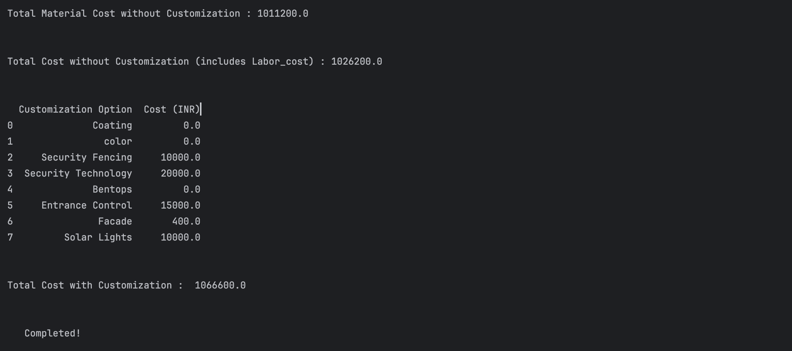

---

# Horus 2.0: A-1 Fence Cost Estimator

## Overview

The A-1 Fence Cost Estimator is a Python-based tool developed to provide a comprehensive solution for calculating the total cost of a 1 km fencing project. The program considers various components, their weights, costs, and quantities, allowing for customized options based on user input.

## Key Features

- **Component Database**: Stores details such as component name, weight, price, and quantity.
- **Customization Options**: Allows users to select from various coating types, security options, colors, and accessories.
- **Cost Calculation**: Computes the required quantities, weights, and costs of components, as well as labor and additional features.
- **Detailed Output**: Provides a breakdown of total costs, including materials, labor, and customization.

## Input Parameters

The program accepts the following input parameters:
- Length of the fence (fixed at 1 km for this version)
- User-selected customization options (e.g., coating type, security features, color, accessories)

## Calculation Logic

1. **Component Quantity**: Calculates the number of fence posts, base plates, anchor plates, clamps, and weld mesh panels required.
2. **Material Costs and Weight**: Computes the total weight and price of each component based on the user's selections and market conditions.
3. **Labor Costs**: Calculates installation labor costs based on the size, difficulty, and location of the project.
4. **Additional Costs**: Includes costs for security features, coatings, and other relevant customization options.

## Assumptions and Limitations

- Material prices and labor rates are subject to change based on market conditions and location.
- The program currently supports basic customization options; more advanced features may be added in future versions.
- The program has been tested with various input values to ensure accuracy, but real-world variations may occur.

## How to Use

1. Clone the repository:
   ```bash
   git clone https://github.com/sainandan2004/Horus-2.0_A-1-Launchpad.git
   ```
2. Navigate to the project directory:
   ```bash
   cd Horus-2.0_A-1-Launchpad
   ```
3. Install the required libraries:
   ```bash
   pip install pandas
   ```
4. Run the main script:
   ```bash
   python fencing_cost_calculator.py
   ```
5. Follow the prompts to input the required parameters and select customization options.

## Required Libraries

Make sure you have the following libraries installed:

- Python 3.x
- `pandas` (for data management)

You can install these libraries using the command:

```bash
pip install pandas
```

## Example Output

Here is an example of the output produced by the estimator:




## Customization Options

- **Coating Options**: Hot Dip Galvanized, Thermosetting Powder Coating (TPC), Powder Coat (PPC)
- **Security Options**: Electric Fencing, Wall Spikes, Concertina Coil
- **Color Choices**: Multiple colors available to match surroundings
- **Security Tech Options**: Intrusion Detection, Surveillance Cameras
- **Additional Accessories**: Bentops, Entrance & Access Control Solutions, Solar-Powered Lighting

## Testing and Validation

The program has been thoroughly tested with unit tests to ensure the correctness of individual functions and overall calculations.

## Contributions 😎

Contributions are welcomed ! Please open an issue to discuss your ideas, or submit a pull request with your changes.

## Contact

For any questions or feedback, please contact the team members:
- Kashireddy Sai Nandan Reddy
- Padarthi Sai Kousik

---

### Instructions for Adding Output Images

Make sure to place your output images in an `images` folder within the project directory. Replace the placeholders `output1.png` and `output2.png` with your actual output image filenames.

Feel free to adjust any details according to your specific project!
